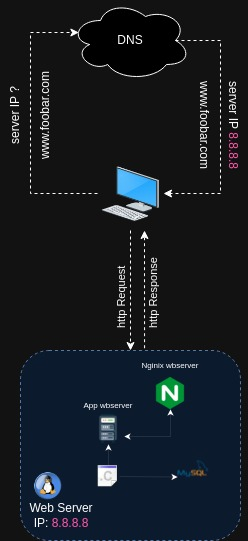

# Project Overview:

## Description
This project outlines a basic web infrastructure designed to host a website accessible via www.foobar.com. The infrastructure lacks advanced security measures such as firewalls or SSL certificates. It operates on a single server, sharing resources like CPU, RAM, and SSD among its components, including the database and application server.
Infrastructure Components
1. Server

    Definition: A hardware or software entity that provides services to other computers (clients).

2. Domain Name

    Role: Provides a user-friendly alias for an IP address, utilizing the Domain Name System (DNS).

3. DNS Record Type for "www.foobar.com"

    Type: A record, confirmed through DNS lookup using the command dig www.foobar.com.

4. Web Server (Nginx)

    Role: Accepts and responds to HTTP or HTTPS requests with the requested content or error messages.

5. Application Server

    Role: Installs, operates, and hosts applications and associated services for end-users and organizations, facilitating the delivery of various high-end applications.

6. Database (MySQL)

    Role: Manages organized information that can be easily accessed, managed, and updated.

7. Communication Protocol

    Description: Client-server communication occurs over the internet network using the TCP/IP protocol suite.

Infrastructure Challenges
1. Single Point Of Failure (SPOF)

    Issue: Multiple points of failure exist within the infrastructure, leading to complete site inaccessibility in case of a critical failure, such as the MySQL database server going down.

2. Downtime During Maintenance

    Issue: Routine maintenance checks require taking components offline or shutting down the entire server, resulting in website downtime.

3. Scalability Limitations

    Issue: Limited scalability potential due to resource constraints on the single server, causing potential performance degradation during periods of increased traffic.

