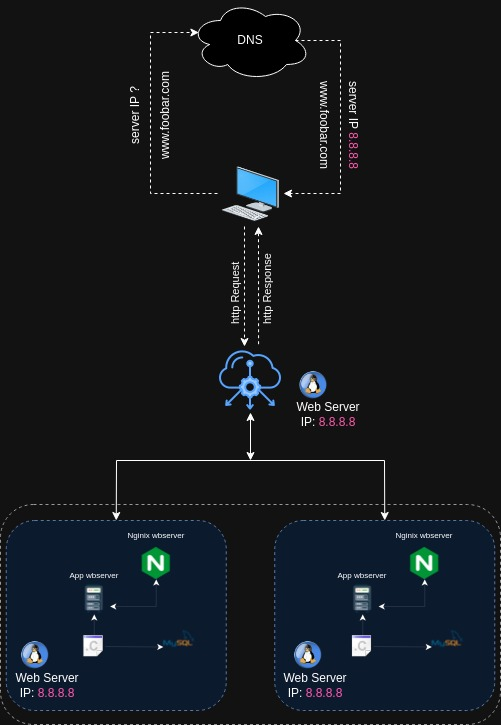

# Project Overview:

# Description

This project presents a distributed web infrastructure designed to host the website www.foobar.com. The infrastructure utilizes three servers, including a load balancer (HAproxy) to distribute incoming traffic, ensuring high availability and improved performance.
## Components

    Server 1:
        Web Server (Nginx): Responsible for handling HTTP requests and serving static content.

    Server 2:
        Application Server: Manages and delivers the dynamic content of the website, handling application-specific tasks.

    Server 3:
        Database (MySQL): Manages the storage and retrieval of structured data required for the website's functioning.

    Load Balancer (HAproxy):
        Distributes incoming network traffic across multiple servers to ensure efficient resource utilization and prevent overloading of individual servers.

    Application Files (Code Base):
        Includes the necessary files and code base essential for the website's functionalities and features.

## Architecture Overview

    The load balancer (HAproxy) distributes incoming requests among the two servers, optimizing resource usage and preventing any single point of failure.
    Nginx serves static content, while the application server manages dynamic content, ensuring smooth and efficient delivery of the website's services.
    MySQL acts as the central repository for the website's data, providing a reliable and scalable storage solution for all necessary information.

## Deployment

    Ensure proper configuration of each server, including the setup and installation of Nginx, the application server, and MySQL.
    Configure the load balancer to distribute incoming traffic evenly across the servers.
    Deploy the application files onto the application server, ensuring compatibility and functionality with the web infrastructure.
    Configure the database to effectively manage and store data essential for the website's operation.

## Considerations

    Regularly monitor the load balancer's performance to ensure efficient traffic distribution and optimal server utilization.
    Implement robust backup and recovery strategies for the database to prevent data loss and ensure data integrity.
    Perform routine maintenance checks on all servers to guarantee smooth operation and minimize potential downtime.

