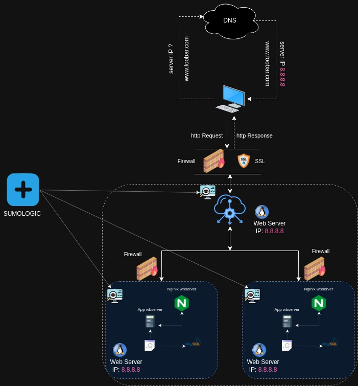

# Project Overview:

# Description

This project entails the design of a secured and monitored three-server web infrastructure to host the website www.foobar.com. The infrastructure is equipped with multiple firewalls, SSL certificate encryption for HTTPS, and comprehensive monitoring through data collectors.

## Components

    Server 1:
        Web Server (Nginx): Responsible for handling HTTP and HTTPS requests, serving both static and encrypted content securely.

    Server 2:
        Application Server: Manages the dynamic content of the website while ensuring secure and encrypted data transmission.

    Server 3:
        Database (MySQL): Safely stores and manages sensitive information, enforcing stringent security protocols to protect data integrity.

## Security Measures

    Firewalls:
        Three firewalls are implemented to fortify the infrastructure against potential security threats and unauthorized access attempts.

    SSL Certificate:
        Utilizes an SSL certificate to enable secure communication between the web server and clients, ensuring encrypted data transmission over HTTPS.

## Monitoring Setup

    Data Collectors:
        Three monitoring clients, serving as data collectors, are integrated to enable comprehensive monitoring of the web infrastructure. They facilitate real-time data collection for analysis and prompt detection of any anomalies or security breaches.

## Deployment and Configuration

    Ensure the proper installation and configuration of firewalls on each server to enforce strict access controls and security policies.
    Configure Nginx to serve encrypted traffic securely using the SSL certificate for www.foobar.com over HTTPS.
    Integrate and configure monitoring clients to collect and analyze data, providing real-time insights into the performance and security of the web infrastructure.
    Implement regular security audits and updates to ensure the continuous protection and optimal performance of the secured infrastructure.

## Considerations

    Periodically update SSL certificates to maintain strong encryption standards and ensure secure data transmission.
    Regularly review and analyze monitoring data to detect and address any potential security vulnerabilities or performance issues promptly.
