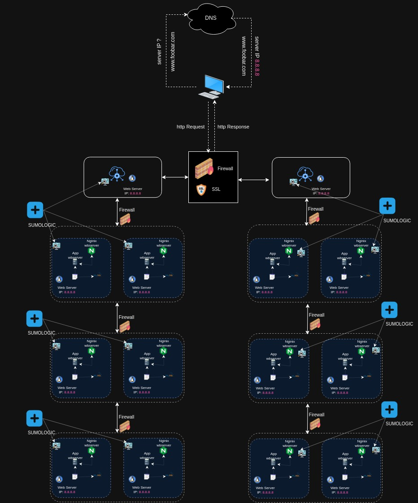

# Project Overview:

# Description

This project focuses on scaling up the web infrastructure by implementing a split component setup with dedicated servers for the web server, application server, and database. Additionally, it incorporates a load-balancer (HAproxy) configured as a cluster to enhance performance and ensure high availability.

## Components

    Server 1:
        Load Balancer Cluster (HAproxy): Configured as a cluster with another load balancer to distribute incoming traffic efficiently and ensure high availability.

    Server 2:
        Web Server (Nginx): Dedicated server responsible for handling HTTP and HTTPS requests and serving static content to the users.

    Server 3:
        Application Server: Dedicated server managing and delivering dynamic content, thereby offloading processing tasks from the web server.

    Server 4:
        Database (MySQL): Dedicated server exclusively managing the storage and retrieval of structured data, ensuring data integrity and accessibility for the application and web servers.

## Scale-Up Configuration

    Deploy and configure the load balancer cluster (HAproxy) to efficiently distribute incoming traffic across the web and application servers, enhancing performance and ensuring high availability.
    Set up the web server (Nginx) to efficiently handle HTTP and HTTPS requests, serving static content securely and reliably.
    Configure the application server to manage the dynamic content of the website, optimizing processing tasks and enhancing overall performance.
    Implement the database server (MySQL) to securely store and manage the website's structured data, providing robust data integrity and accessibility for the application and web servers.

## Considerations

    Regularly monitor the load balancer cluster's performance to ensure even traffic distribution and high availability across the servers.
    Implement effective backup and recovery strategies for the database server to prevent data loss and maintain data integrity.
    Conduct routine maintenance checks on all servers to ensure optimal performance, scalability, and high availability of the web infrastructure.
